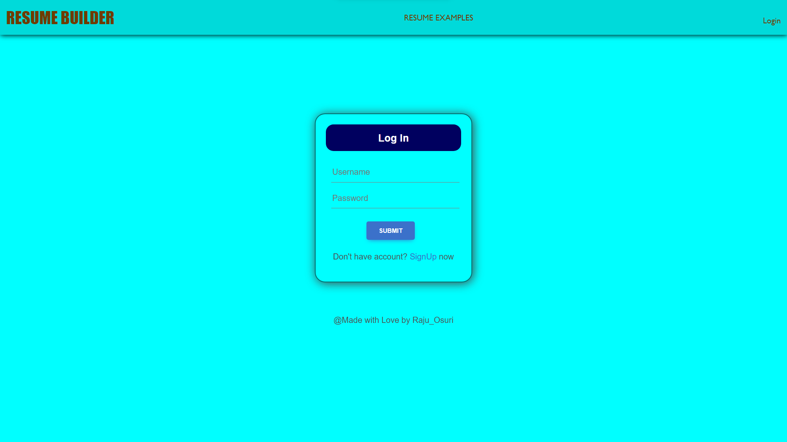
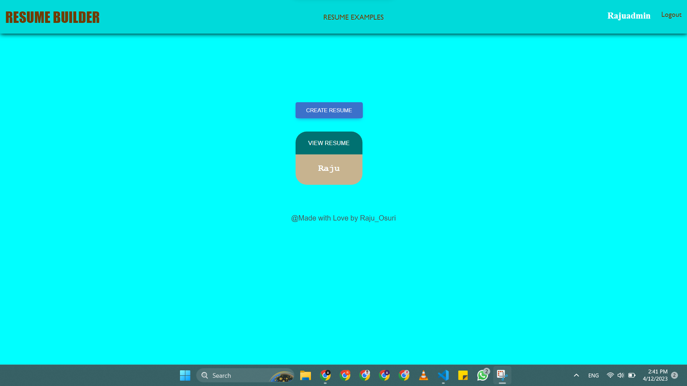
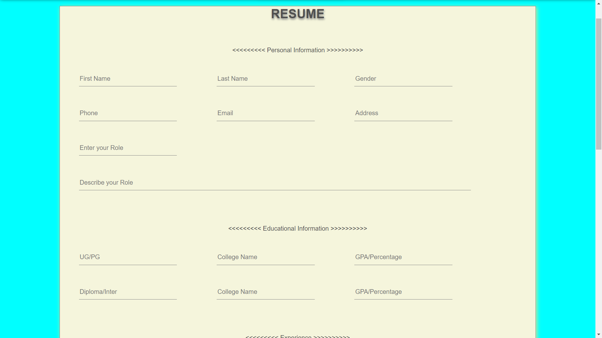
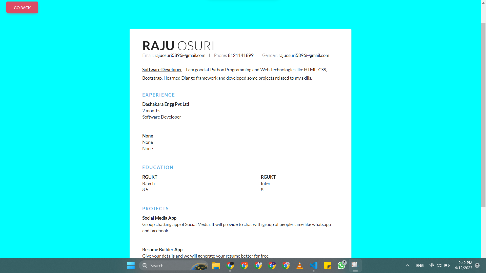

# Online-Resume-Builder
An Online Resume Builder app developed using Django, HTML, CSS, Bootstrap, Javascript

<h1>Index Page</h1>

This is index page, if you want to create resume you must login to your account.

<h1>Login Page</h1>

If you have no account, you can create new account by registering with your details.

<h1>Dashboard</h1>

After logging in, you will see the button to create a resume and the list of resumes you have created earlier. You can create as many as resumes.

<h1>Resume Creating</h1>

After filling all the above details mentioned in the page. You can submit the form.

<h1>View Resume</h1>

Your final resume will look like this.

<h1>Options for Resume</h1>

You can update your resume. You can Generate pdf version of your resume. You can delete your resume from the database.

<h1>Thank You</h1>
